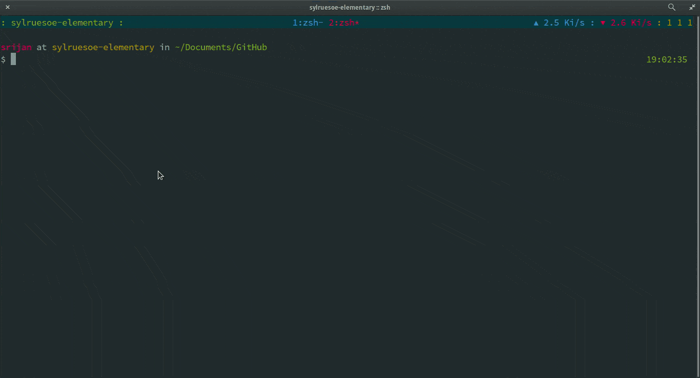

> SCP for directories

```
             __
   _________/ /___
  / ___/ __  / __ \
 (__  ) /_/ / /_/ /
/____/\__,_/ .___/
          /_/
```

## Install

1. Copy [sdp](sdp) and [\_sdp](\_sdp) to $FPATH. [sdp](sdp) is meant to be used as an autoloadable function.

## Usage



## Credits

Taken from [commandlinefu](commandlinefu.com)
